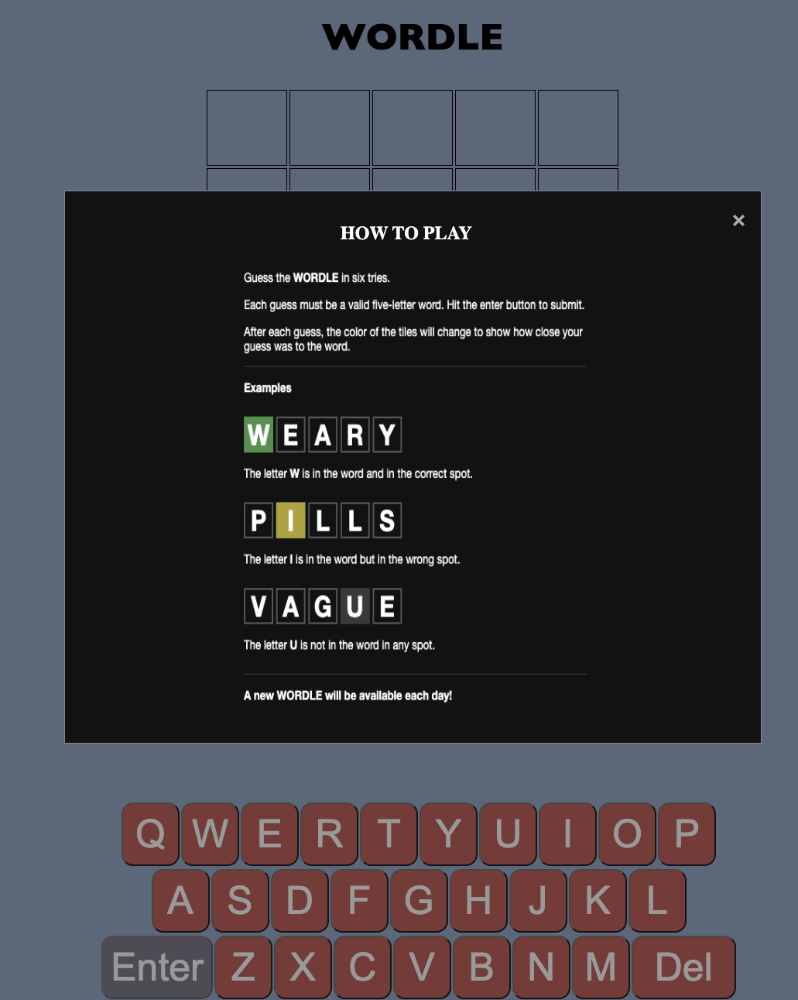
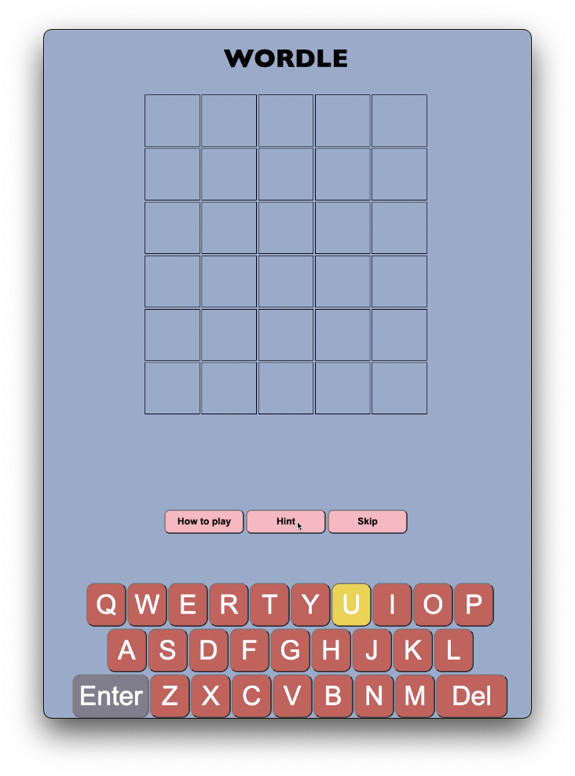
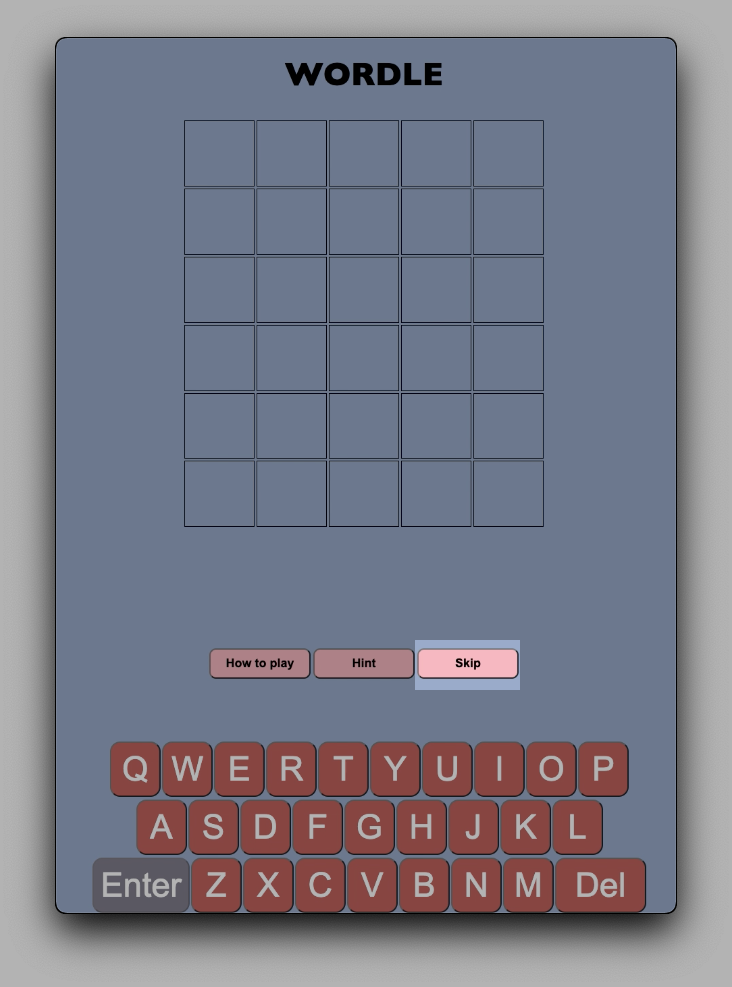

# WORDLE

## Link to my wordle:

<https://juliexxvi.github.io/>

## Description

### 1. Purpose:

Over the past few weeks, people have been sharing tweets and posts showing a collection of small green and gray boxes. If you’ve come across those but don’t know what it’s all about – that’s Wordle. A free word-guessing game that’s available online.

The objective of the game is to unlock a secret 5-letter word. You only have six attempts to do so and there’s only one puzzle available each day. If you didn’t get it in the first six tries, you have to wait until the next day to try and redeem yourself.

### 2. Functionality / features:

**How to play** - a brief introduction about how to play the wordle game

**Hint** - showing a correct but not in the right position. User will need to guess where the correct position is.

**Skip** - to reload the page if user cannot guess the correct or they want to play again

### 3. What's next?

- Add dictionary to help user knows what exact meanings of the correct word.
- Enhance hint button to show up in wordle boxes.
- Add more animation
- Enhance front-end to be responsive GUI, i.e. mobile, tablet, desktop.

### 4. Tech stack:

- HTML
- CSS
- JavaScript
- VSCode.
